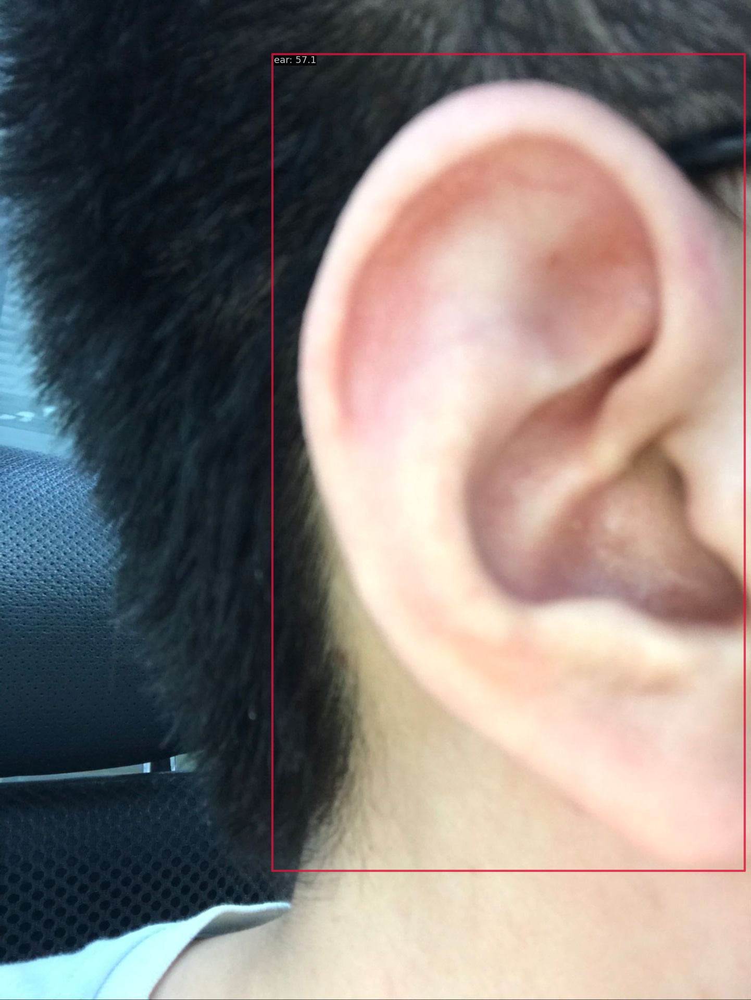
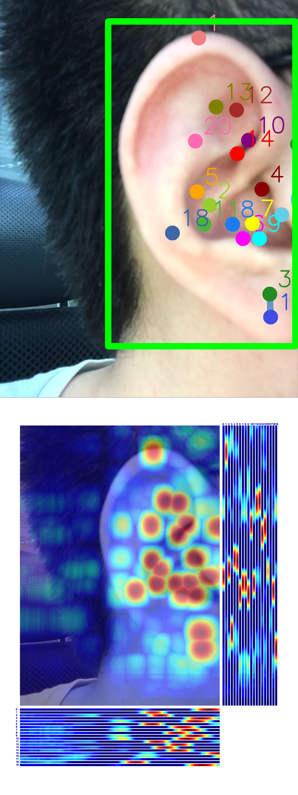

# MMCamp第一次作业
- 学习笔记
  - [AI实战营第二期_03MMPose实战_学习笔记](https://bbs.csdn.net/topics/615773111)
## 目标检测结果
- 测试集评估指标
    ```angular2html
     Average Precision  (AP) @[ IoU=0.50:0.95 | area=   all | maxDets=100 ] = 0.809
     Average Precision  (AP) @[ IoU=0.50      | area=   all | maxDets=100 ] = 0.968
     Average Precision  (AP) @[ IoU=0.75      | area=   all | maxDets=100 ] = 0.968
     Average Precision  (AP) @[ IoU=0.50:0.95 | area= small | maxDets=100 ] = -1.000
     Average Precision  (AP) @[ IoU=0.50:0.95 | area=medium | maxDets=100 ] = -1.000
     Average Precision  (AP) @[ IoU=0.50:0.95 | area= large | maxDets=100 ] = 0.809
     Average Recall     (AR) @[ IoU=0.50:0.95 | area=   all | maxDets=  1 ] = 0.840
     Average Recall     (AR) @[ IoU=0.50:0.95 | area=   all | maxDets= 10 ] = 0.840
     Average Recall     (AR) @[ IoU=0.50:0.95 | area=   all | maxDets=100 ] = 0.840
     Average Recall     (AR) @[ IoU=0.50:0.95 | area= small | maxDets=100 ] = -1.000
     Average Recall     (AR) @[ IoU=0.50:0.95 | area=medium | maxDets=100 ] = -1.000
     Average Recall     (AR) @[ IoU=0.50:0.95 | area= large | maxDets=100 ] = 0.840
    06/06 15:00:09 - mmengine - INFO - bbox_mAP_copypaste: 0.809 0.968 0.968 -1.000 -1.000 0.809
    06/06 15:00:09 - mmengine - INFO - Epoch(test) [11/11]  coco/bbox_mAP: 0.8090  coco/bbox_mAP_50: 0.9680  coco/bbox_mAP_75: 0.9680  coco/bbox_mAP_s: -1.0000  coco/bbox_mAP_m: -1.0000  coco/bbox_mAP_l: 0.8090data_time: 0.5773  time: 0.6206  
    ```
- 图像结果
    - 
- 视频结果(为方便查看转为gif格式)
    - 
## 关键点检测结果
- 测试集评估指标
  ```angular2html
   Average Precision  (AP) @[ IoU=0.50:0.95 | area=   all | maxDets= 20 ] =  0.743
   Average Precision  (AP) @[ IoU=0.50      | area=   all | maxDets= 20 ] =  1.000
   Average Precision  (AP) @[ IoU=0.75      | area=   all | maxDets= 20 ] =  0.970
   Average Precision  (AP) @[ IoU=0.50:0.95 | area=medium | maxDets= 20 ] = -1.000
   Average Precision  (AP) @[ IoU=0.50:0.95 | area= large | maxDets= 20 ] =  0.743
   Average Recall     (AR) @[ IoU=0.50:0.95 | area=   all | maxDets= 20 ] =  0.790
   Average Recall     (AR) @[ IoU=0.50      | area=   all | maxDets= 20 ] =  1.000
   Average Recall     (AR) @[ IoU=0.75      | area=   all | maxDets= 20 ] =  0.976
   Average Recall     (AR) @[ IoU=0.50:0.95 | area=medium | maxDets= 20 ] = -1.000
   Average Recall     (AR) @[ IoU=0.50:0.95 | area= large | maxDets= 20 ] =  0.790
  06/06 21:30:26 - mmengine - INFO - Evaluating PCKAccuracy (normalized by ``"bbox_size"``)...
  06/06 21:30:26 - mmengine - INFO - Evaluating AUC...
  06/06 21:30:26 - mmengine - INFO - Evaluating NME...
  06/06 21:30:26 - mmengine - INFO - Epoch(test) [6/6]  coco/AP: 0.742738  coco/AP .5: 1.000000  coco/AP .75: 0.970297  coco/AP (M): -1.000000  coco/AP (L): 0.742738  coco/AR: 0.790476  coco/AR .5: 1.000000  coco/AR .75: 0.976190  coco/AR (M): -1.000000  coco/AR (L): 0.790476  PCK: 0.976190  AUC: 0.135317  NME: 0.039376data_time: 1.938691  time: 1.979971  
  ```
- 图像结果
    - 
- 视频结果(为方便查看转为gif格式)
    - 
