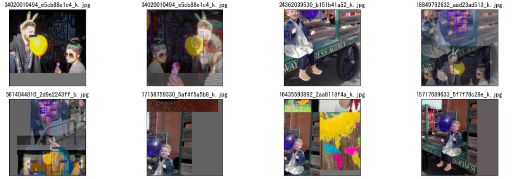
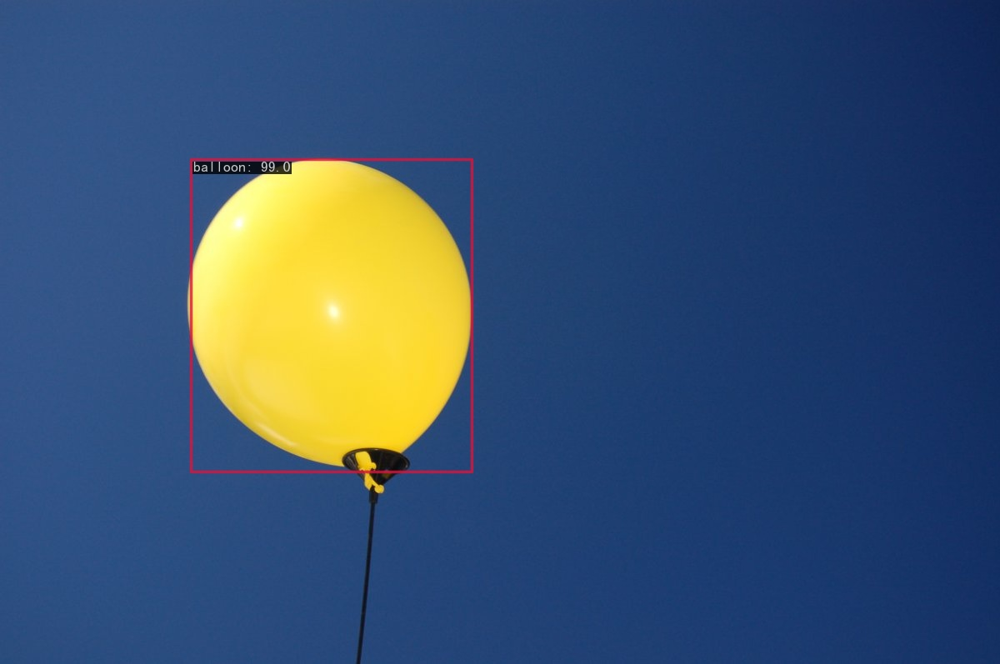
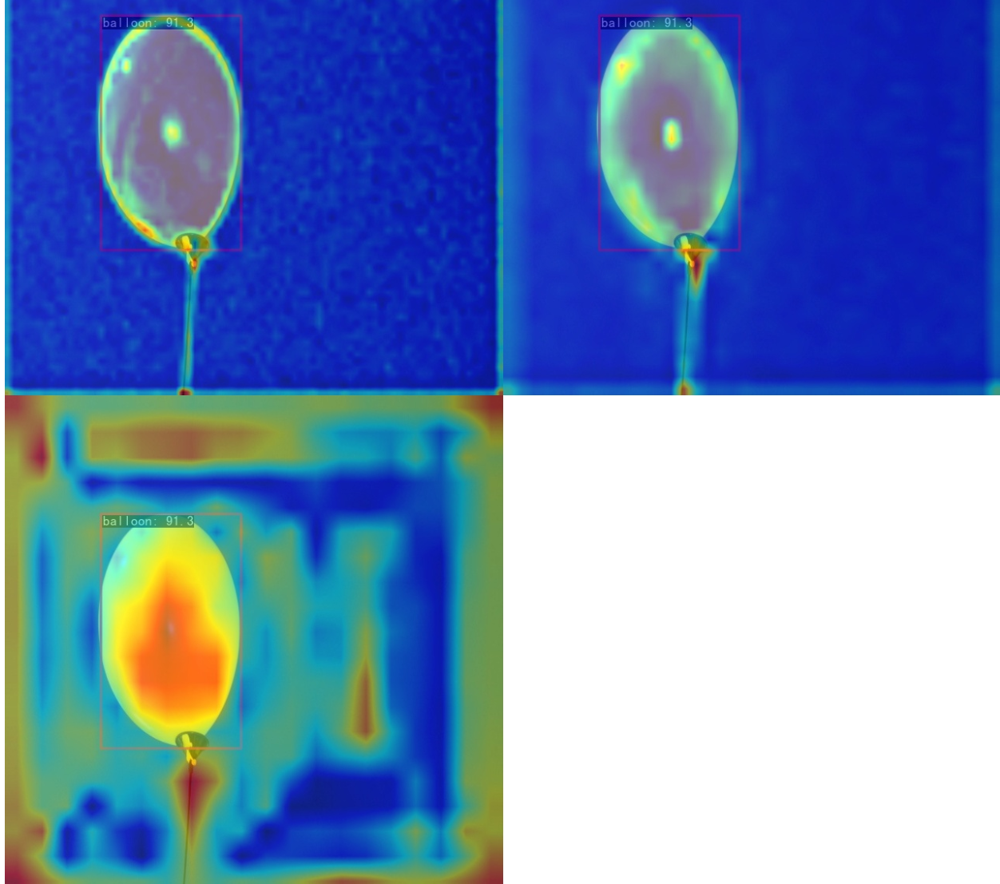
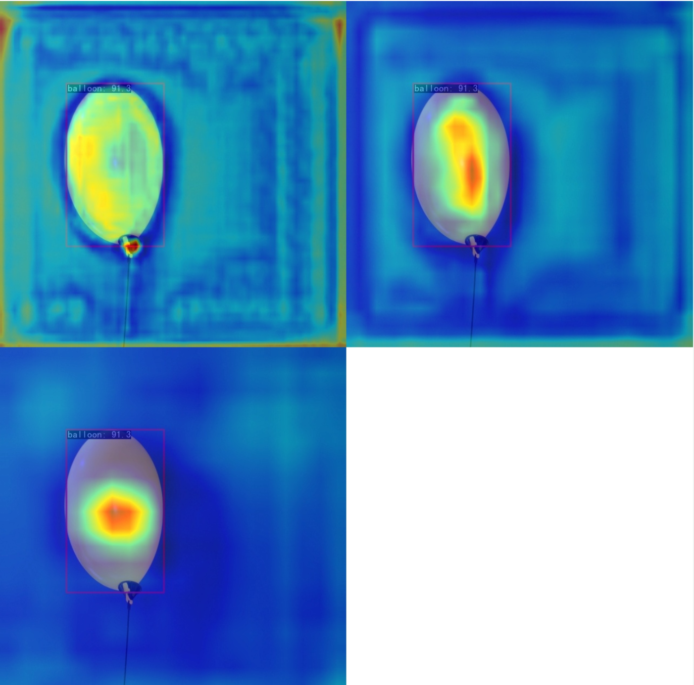
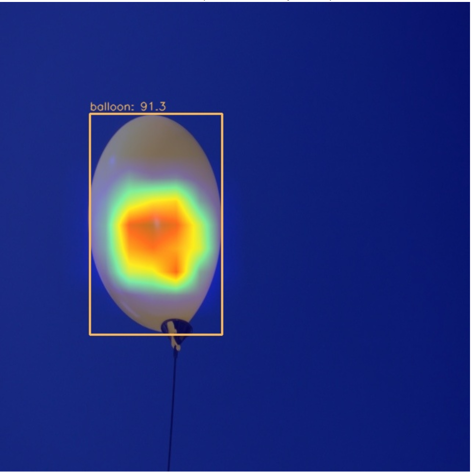

# 气球数据集检测
- 数据集准备及训练：[run.ipynb](./run.ipynb)
- 可视化：[analyse.ipynb](./analyse.ipynb)
## 数据集准备
1. 下载数据集 
   - 下载对应数据集
   - 将数据集转换为COCO格式
2. 数据集可视化
   - 
3. 训练并得到测试集评估指标
   - 训练时没有冻结backbone层权重
   - 详见：[log](./20230611_220118.log)
   - ```
     Accumulating evaluation results...
     DONE (t=0.15s).
      Average Precision  (AP) @[ IoU=0.50:0.95 | area=   all | maxDets=100 ] = 0.962
      Average Precision  (AP) @[ IoU=0.50      | area=   all | maxDets=100 ] = 0.995
      Average Precision  (AP) @[ IoU=0.75      | area=   all | maxDets=100 ] = 0.995
      Average Precision  (AP) @[ IoU=0.50:0.95 | area= small | maxDets=100 ] = -1.000
      Average Precision  (AP) @[ IoU=0.50:0.95 | area=medium | maxDets=100 ] = -1.000
      Average Precision  (AP) @[ IoU=0.50:0.95 | area= large | maxDets=100 ] = 0.962
      Average Recall     (AR) @[ IoU=0.50:0.95 | area=   all | maxDets=  1 ] = 0.946
      Average Recall     (AR) @[ IoU=0.50:0.95 | area=   all | maxDets= 10 ] = 0.975
      Average Recall     (AR) @[ IoU=0.50:0.95 | area=   all | maxDets=100 ] = 0.975
      Average Recall     (AR) @[ IoU=0.50:0.95 | area= small | maxDets=100 ] = -1.000
      Average Recall     (AR) @[ IoU=0.50:0.95 | area=medium | maxDets=100 ] = -1.000
      Average Recall     (AR) @[ IoU=0.50:0.95 | area= large | maxDets=100 ] = 0.975
     06/11 22:05:51 - mmengine - INFO - bbox_mAP_copypaste: 0.962 0.995 0.995 -1.000 -1.000 0.962
     06/11 22:05:51 - mmengine - INFO - Epoch(test) [56/56]  coco/bbox_mAP: 0.9620  coco/bbox_mAP_50: 0.9950  coco/bbox_mAP_75: 0.9950  coco/bbox_mAP_s: -1.0000  coco/bbox_mAP_m: -1.0000  coco/bbox_mAP_l: 0.9620data_time: 4.4980  time: 4.5263  
     ```
4. 用单张图片进行预测
   - 
5. 可视化
   - 特征图可视化
     - Back层可视化
       - 
     - Neck层可视化
       - 
   - Box AM可视化
     - Neck层输出的最小尺度输出特征图的 Grad CAM
       - 