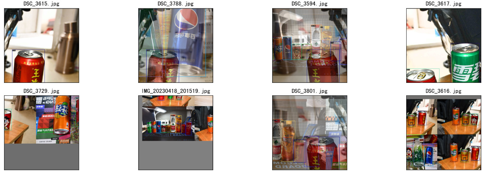
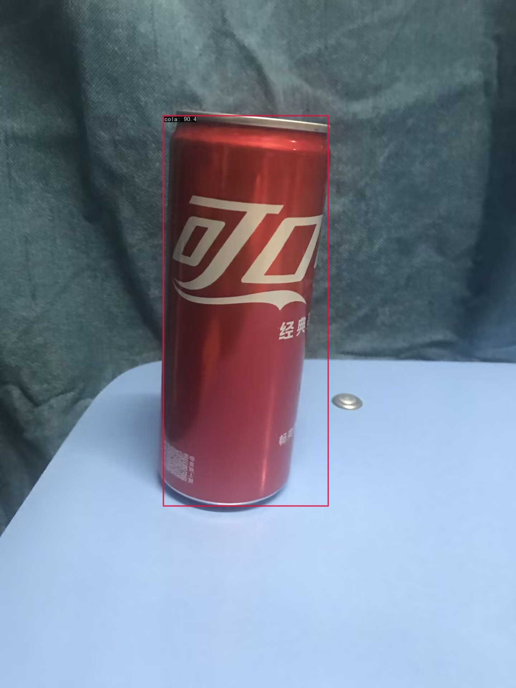
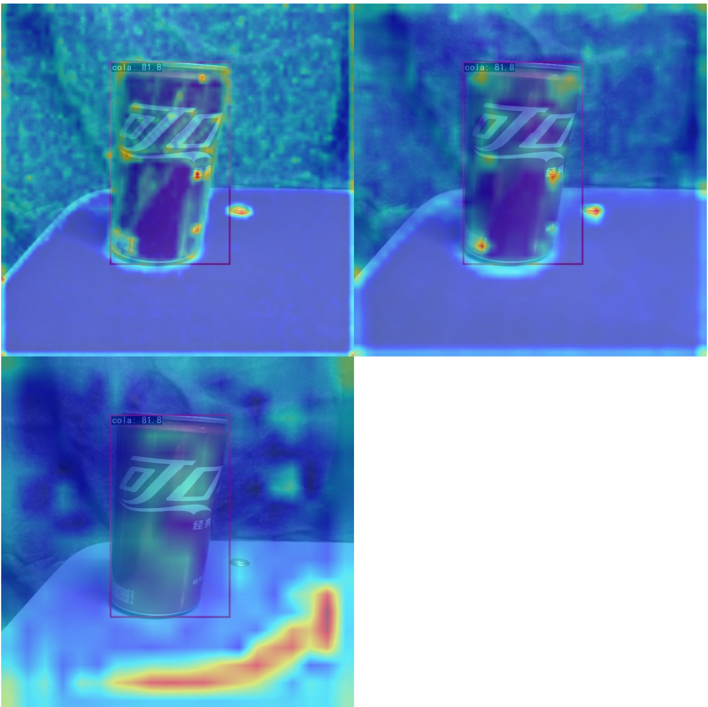
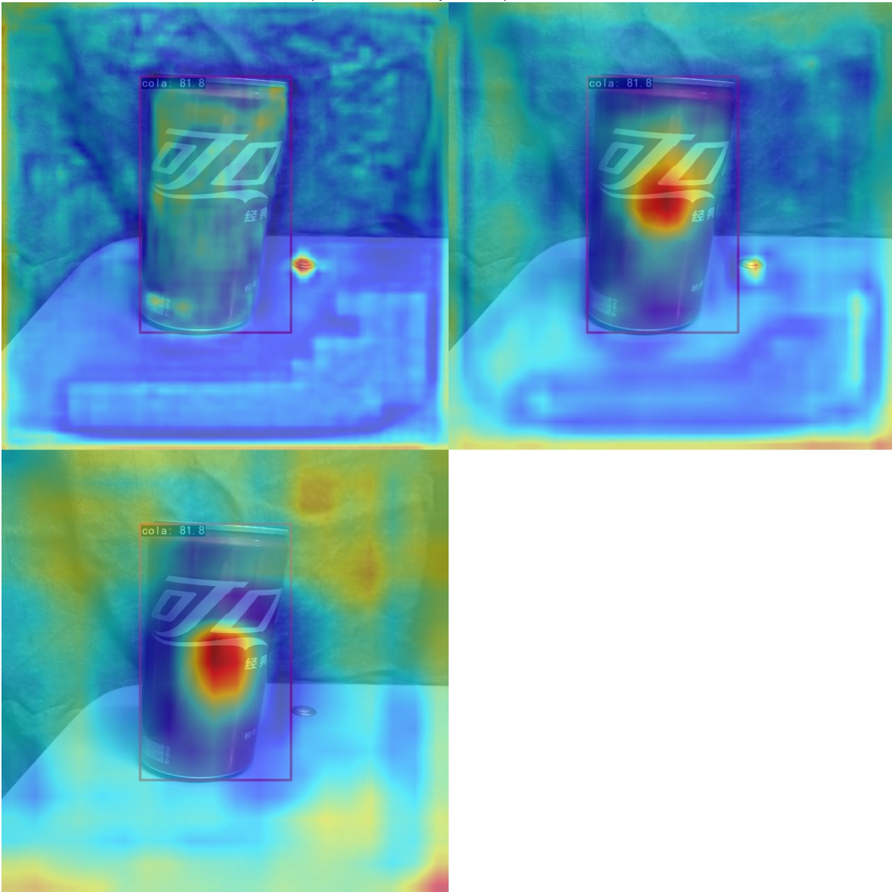
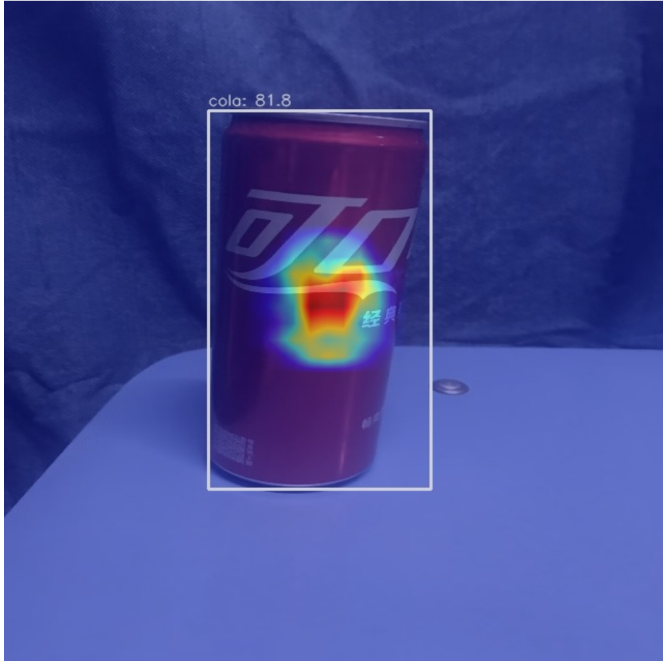

# 气球数据集检测
- 数据集准备及训练：[run.ipynb](./run.ipynb)
- 可视化：[analyse.ipynb](./analyse.ipynb)
## 数据集准备
1. 下载数据集 
   - 下载对应数据集
   - 将数据集转换为COCO格式
2. 数据集可视化
   - 
3. 训练并得到测试集评估指标
   - 详见：[log](./)
   - ```
     Accumulating evaluation results...
     DONE (t=0.02s).
      Average Precision  (AP) @[ IoU=0.50:0.95 | area=   all | maxDets=100 ] = 0.711
      Average Precision  (AP) @[ IoU=0.50      | area=   all | maxDets=100 ] = 0.835
      Average Precision  (AP) @[ IoU=0.75      | area=   all | maxDets=100 ] = 0.777
      Average Precision  (AP) @[ IoU=0.50:0.95 | area= small | maxDets=100 ] = 0.000
      Average Precision  (AP) @[ IoU=0.50:0.95 | area=medium | maxDets=100 ] = 0.361
      Average Precision  (AP) @[ IoU=0.50:0.95 | area= large | maxDets=100 ] = 0.848
      Average Recall     (AR) @[ IoU=0.50:0.95 | area=   all | maxDets=  1 ] = 0.240
      Average Recall     (AR) @[ IoU=0.50:0.95 | area=   all | maxDets= 10 ] = 0.734
      Average Recall     (AR) @[ IoU=0.50:0.95 | area=   all | maxDets=100 ] = 0.808
      Average Recall     (AR) @[ IoU=0.50:0.95 | area= small | maxDets=100 ] = 0.000
      Average Recall     (AR) @[ IoU=0.50:0.95 | area=medium | maxDets=100 ] = 0.667
      Average Recall     (AR) @[ IoU=0.50:0.95 | area= large | maxDets=100 ] = 0.900
     06/11 15:07:55 - mmengine - INFO - bbox_mAP_copypaste: 0.711 0.835 0.777 0.000 0.361 0.848
     06/11 15:07:55 - mmengine - INFO - Epoch(test) [13/13]  coco/bbox_mAP: 0.7110  coco/bbox_mAP_50: 0.8350  coco/bbox_mAP_75: 0.7770  coco/bbox_mAP_s: 0.0000  coco/bbox_mAP_m: 0.3610  coco/bbox_mAP_l: 0.8480data_time: 0.5454  time: 0.5699  
     ```
4. 用单张图片进行预测
   - 
5. 可视化
   - 特征图可视化
     - Back层可视化
       - 
     - Neck层可视化
       - 
   - Box AM可视化
     - Neck层输出的中等尺度输出特征图的 Grad CAM
       - 