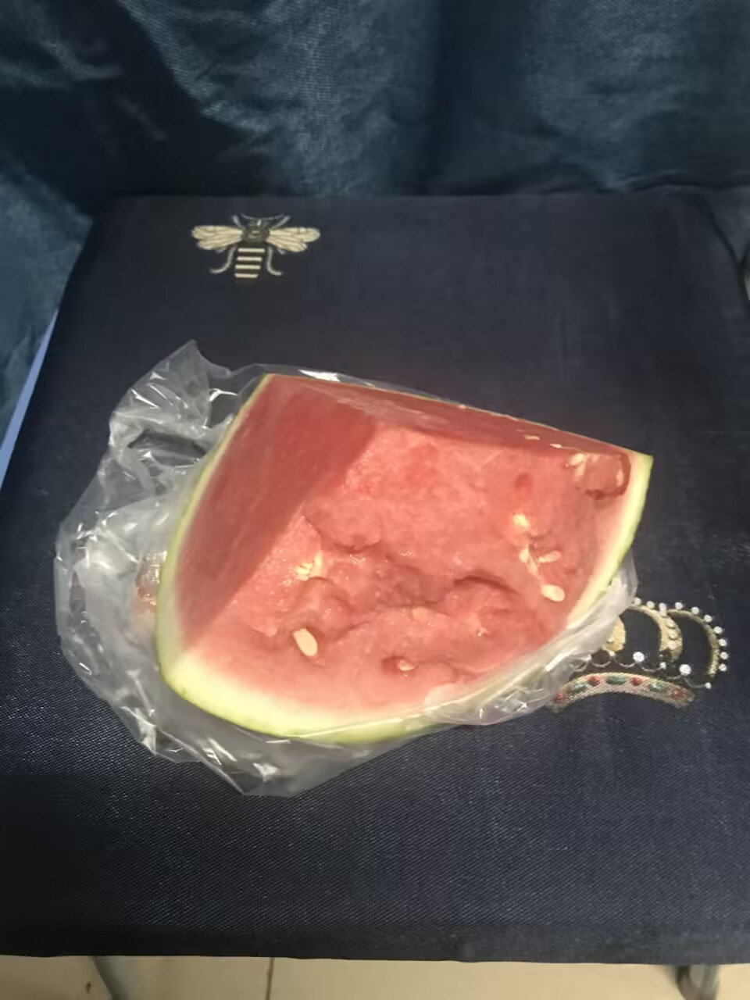
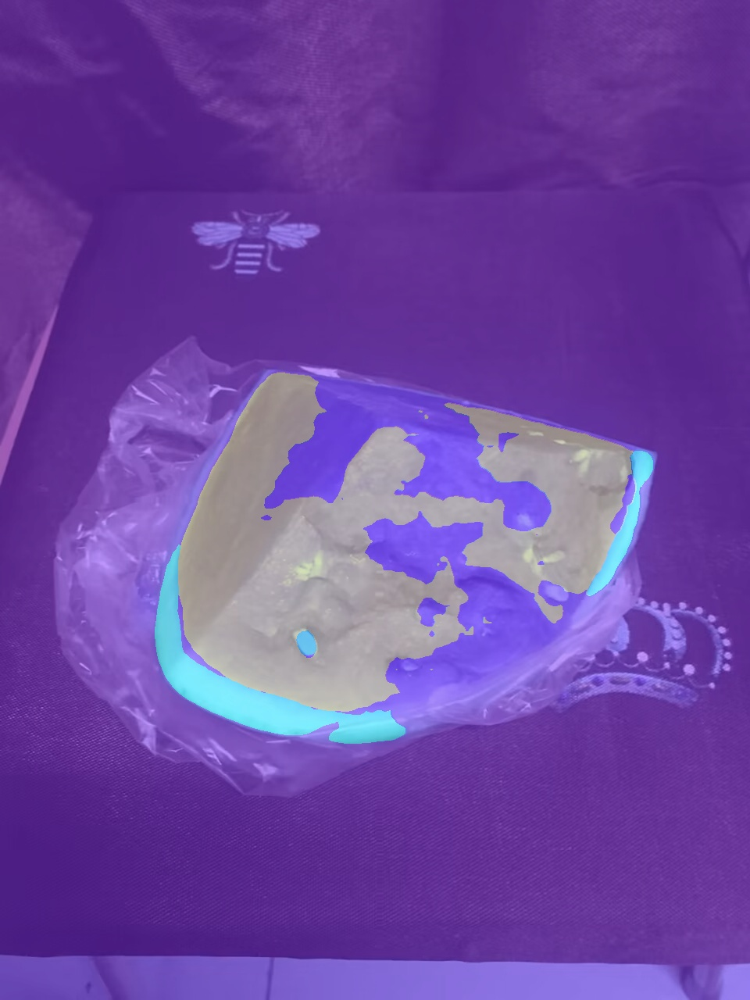
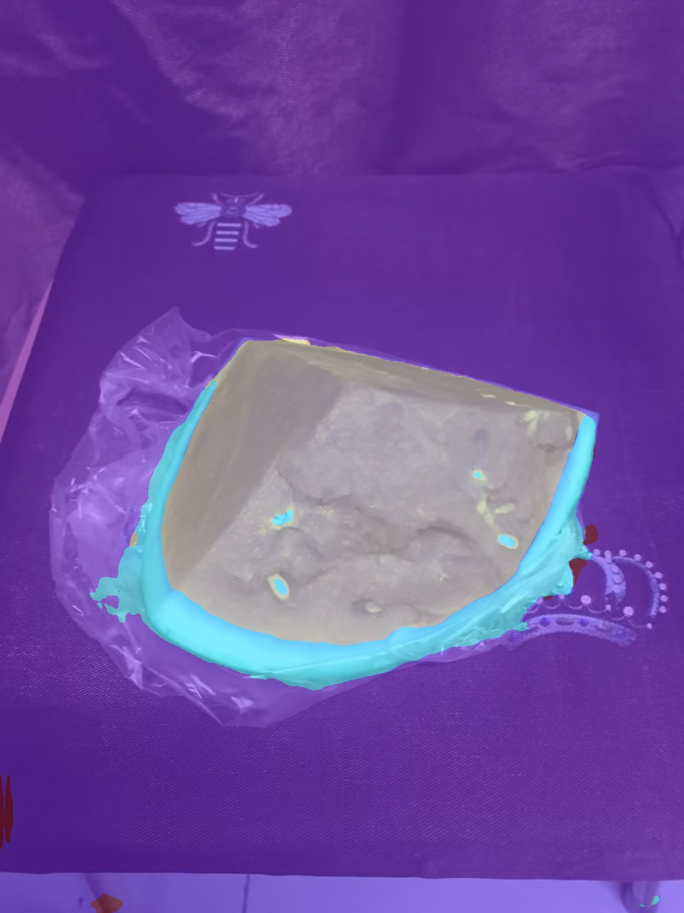

# MMCamp第四次作业
0. 学习笔记(包括踩坑心得等)
   - [AI实战营第二期_09MMSegmentation实战_学习笔记](https://bbs.csdn.net/topics/615974399)
1. Labelme 标注语义分割数据集
   - 谢谢子豪兄
2. 划分训练集和测试集
   - 谢谢子豪兄
3. Labelme 标注转 Mask 灰度图格式
   - 谢谢子豪兄
4. 使用 MMSegmentation 算法库，撰写 config 配置文件，训练 PSPNet 语义分割算法
   - PSPNet
     - 数据集文件：[watermelon.py](./watermelon.py)
     - 配置文件：[pspnet_r50-d8_melon.py](./pspnet_r50-d8_melon.py)
     - 训练文件：[pspnet_run.ipynb](./pspnet_run.ipynb)
   - SegFormer
     - 数据集文件：[watermelon.py](./watermelon.py)
     - 配置文件：[segformer_mit-b2_melon.py](./segformer_mit-b2_melon.py)
     - 训练文件：[segformer_run.ipynb](./segformer_run.ipynb)
5. 测试集评估指标
   - PSPNet:
     - ```
       06/15 09:45:01 - mmengine - INFO - per class results:
       06/15 09:45:01 - mmengine - INFO - 
       +------------+-------+-------+
       |   Class    |  IoU  |  Acc  |
       +------------+-------+-------+
       | background | 96.75 | 98.35 |
       |    red     | 94.29 |  97.9 |
       |   green    | 91.81 | 94.42 |
       |   white    | 82.52 |  91.4 |
       | seed_black |  63.5 | 65.87 |
       | seed_white |  0.0  |  0.0  |
       +------------+-------+-------+
       06/15 09:45:01 - mmengine - INFO - Iter(test) [17/17]  aAcc: 96.9600  mIoU: 71.4800  mAcc: 74.6600data_time: 0.0035  time: 0.8344
       ```
   - SegFormer:
     - ```
       06/15 10:10:43 - mmengine - INFO - per class results:
       06/15 10:10:43 - mmengine - INFO - 
       +------------+-------+-------+
       |   Class    |  IoU  |  Acc  |
       +------------+-------+-------+
       | background |  90.8 | 96.55 |
       |    red     | 92.84 | 97.73 |
       |   green    | 70.57 | 73.57 |
       |   white    | 71.12 | 85.32 |
       | seed_black | 68.56 | 78.55 |
       | seed_white |  0.0  |  0.0  |
       +------------+-------+-------+
       06/15 10:10:43 - mmengine - INFO - Iter(test) [17/17]  aAcc: 93.2900  mIoU: 65.6500  mAcc: 71.9500data_time: 0.0041  time: 0.1628
       ```

6. 自己拍摄西瓜图片和视频进行预测
   - 原图：
     - 
   - 原视频：
     - 
   - PSPNet：
     - 图片
       - 
     - 视频
       - 
   - SegFormer：
     - 图片
       - 
     - 视频
       - 
7. （选做）训练 Segformer 语义分割算法，提交测试集评估指标
   - 详见4，5，6