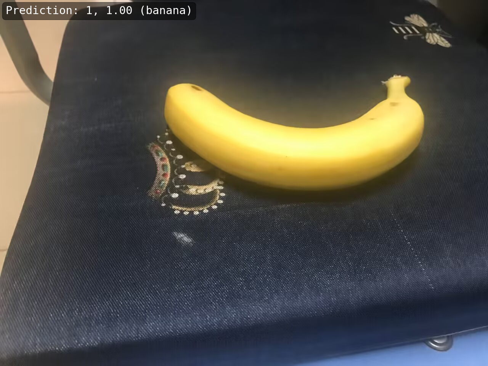

# MMCamp第二次作业

1. 划分数据集
   - 参照网上教程利用`split-folders`划分数据集
     ```angular2html
     import splitfolders
     splitfolders.ratio(input='/root/autodl-tmp/MMPretrain/fruit30', output='/root/autodl-tmp/MMPretrain/fruit30_splited', seed=1337, ratio=(0.8, 0.2))
     ```
2. 按照 MMPreTrain CustomDataset 格式组织训练集和验证集
   - 划分后数据集即为对应格式
   - 避免汉字问题将对应数据集名字更改为对应英文
   - 具体划分和改名详见[split文件](./split.ipynb)
3. 使用 MMPreTrain 算法库，编写配置文件，正确加载预训练模型
   - 此处参照教程使用efficientnet,编写对应配置文件
4. 进行微调训练
   - 采用如下指令进行训练
   ```mim train mmpretrain efficientnet_finetune.py --work-dir=./exp```
   - 训练日志详见文件[日志文件](./20230608_200709.log)
5. 对自己图像进行训练
   - 参照教程进行训练
   - 训练结果
   